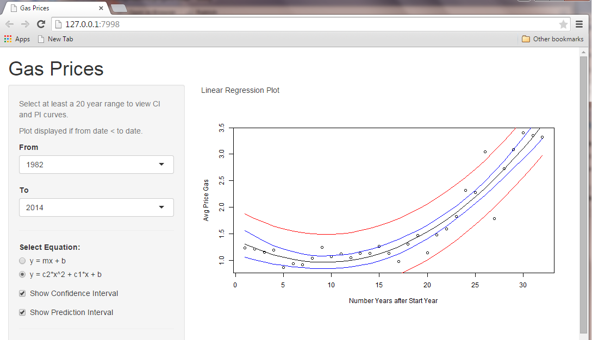

## Shiny Application: Gas Prices

 - Run:  https://ksplett1.shinyapps.io/code
 - Code: https://github.com/ksplett1/GasPrices

<div style="text-align: center;vertical-align: middle;"><br/>

</div>

---

## Linear Regression Model without $\Large x^2$ term

$$
Y_i = \beta_0 + \beta_1 X_i + \epsilon_{i}
$$


```
## Loading required package: doBy
## Loading required package: survival
```


```r
summary(fit)
```

```
## 
## Call:
## lm(formula = avg ~ ix, data = g)
## 
## Residuals:
##     Min      1Q  Median      3Q     Max 
## -0.7624 -0.3438 -0.0191  0.4541  0.7758 
## 
## Coefficients:
##             Estimate Std. Error t value Pr(>|t|)    
## (Intercept) 0.457720   0.168370   2.719   0.0108 *  
## ix          0.072184   0.008905   8.106 4.76e-09 ***
## ---
## Signif. codes:  0 '***' 0.001 '**' 0.01 '*' 0.05 '.' 0.1 ' ' 1
## 
## Residual standard error: 0.4651 on 30 degrees of freedom
## Multiple R-squared:  0.6865,	Adjusted R-squared:  0.6761 
## F-statistic: 65.71 on 1 and 30 DF,  p-value: 4.764e-09
```


--- .smallcode

## Improved Linear Regression Model with $\Large x^2$ term

$$
Y_i = \beta_0 + \beta_1 X_i + \beta_2 X_i^2 + \epsilon_{i}
$$

<style>
  #smallerfont {font-size : 16px}
</style>

<p id=smallerfont> note: decrease in Residual standard error when $\Large X^2$ term included </p>


```r
summary(fit)
```

```
## 
## Call:
## lm(formula = avg ~ ix + ixsq, data = g)
## 
## Residuals:
##      Min       1Q   Median       3Q      Max 
## -0.74531 -0.08001  0.02169  0.10218  0.68738 
## 
## Coefficients:
##               Estimate Std. Error t value Pr(>|t|)    
## (Intercept)  1.3974395  0.1410351   9.908 8.13e-11 ***
## ix          -0.0936492  0.0197035  -4.753 5.04e-05 ***
## ixsq         0.0050252  0.0005793   8.675 1.49e-09 ***
## ---
## Signif. codes:  0 '***' 0.001 '**' 0.01 '*' 0.05 '.' 0.1 ' ' 1
## 
## Residual standard error: 0.2495 on 29 degrees of freedom
## Multiple R-squared:  0.9128,	Adjusted R-squared:  0.9068 
## F-statistic: 151.8 on 2 and 29 DF,  p-value: 4.331e-16
```
